# Library Management System

A simple PHP/MySQL web application for browsing and managing a library catalog, with two separate spaces:

- **Client area** for browsing books, filtering by category, viewing book details, adding books to a cart, placing an order, and updating account information.
- **Librarian area** for managing the catalog, categories, and pending orders.

This project was built as a practical PHP learning project to work on multi-page web development, CRUD operations, authentication flows, image upload handling, and relational database usage.

## Main Features

### Client area
- Client login and registration
- Browse the catalog of available books
- Search books by **ISBN** or **name**
- Browse books by category
- View a detailed page for a selected book
- Add books to cart
- Remove books from cart
- Place an order
- View ordered books
- Update account information and profile picture

### Librarian area
- Librarian login
- View the full list of books
- Add a category
- Add a new book with image upload
- Edit categories
- Edit books
- Delete books
- Search books or categories
- View the category list
- Check pending orders

## Tech Stack

- **PHP**
- **MySQL / MariaDB**
- **phpMyAdmin**
- **Apache2**
- **HTML / CSS**
- **JavaScript**

## Project Structure

```text
Library_management_system/
├── Base_de_donnee/
├── Librarian/
├── file_database/
├── member/
├── db_connect.php
├── index.php
├── logout.php
├── verify_logged_out.php
└── *.css / images / assets
```

### Important folders
- `member/` → client-side pages
- `Librarian/` → librarian-side pages
- `file_database/` → uploaded files and image-related data
- `Base_de_donnee/` → database resources

## Database

The application uses a database named `librairie`.

The SQL dump contains the main tables:
- `category`
- `client`
- `commande`
- `login`
- `loginm`
- `panier`
- `products_commandes`
- `produits`

## Local Installation

### Requirements
Make sure you have:
- Apache2
- PHP
- MySQL or MariaDB
- phpMyAdmin

You can run the project with XAMPP, WAMP, LAMP, or any equivalent local stack.

### Setup
1. Clone the repository:

```bash
git clone https://github.com/AhmedouSalem/Library_management_system.git
```

2. Move the project into your web server root directory.

Examples:
- `htdocs/Library_management_system` for XAMPP
- `www/Library_management_system` for WAMP
- `/var/www/html/Library_management_system` for LAMP

3. Create a database named `librairie` in phpMyAdmin.

4. Import the SQL dump into the `librairie` database.

5. Check the database connection inside `db_connect.php` and adjust it if needed:

```php
$con = mysqli_connect('localhost', 'root', '', 'librairie');
```

6. Start Apache and MySQL.

7. Open the application in your browser:

```text
http://localhost/Library_management_system/
```

## Screenshots

### Client login
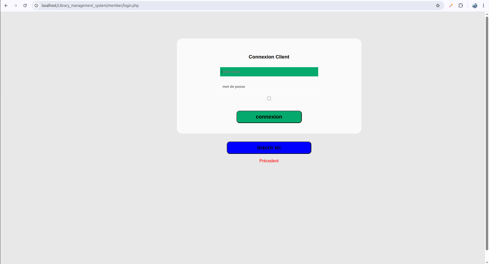

### Client catalog
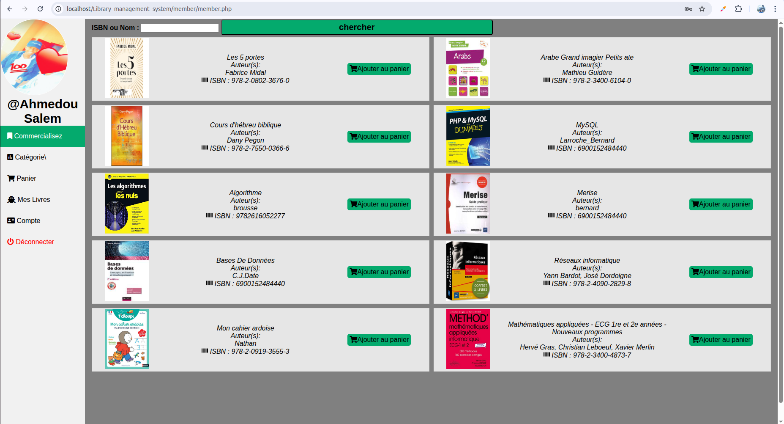

### Book details
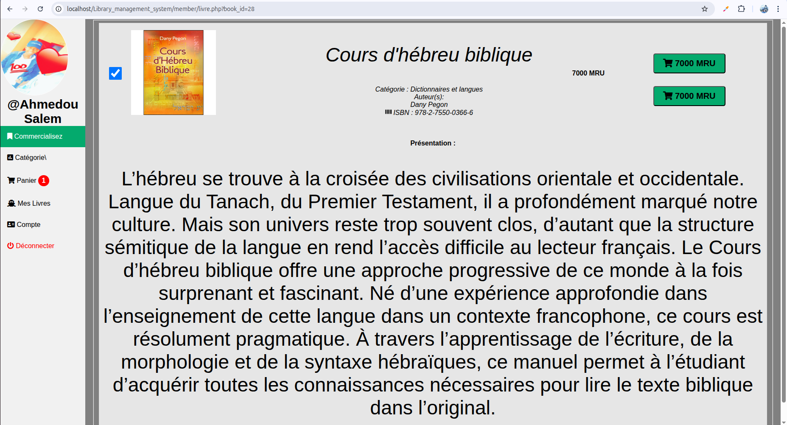

### Client categories
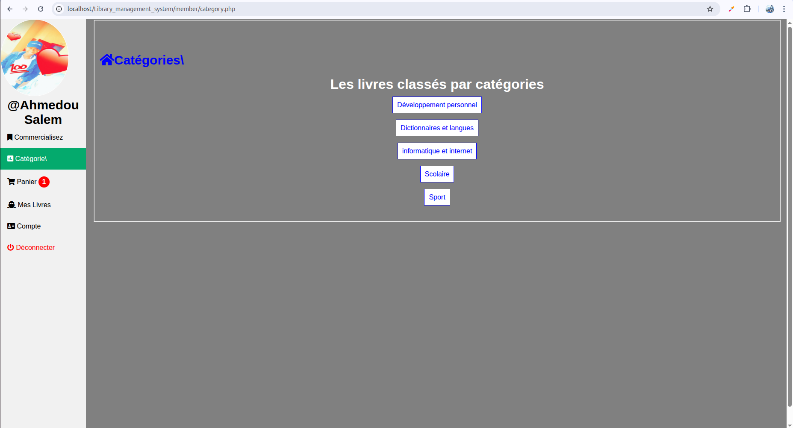

### Cart
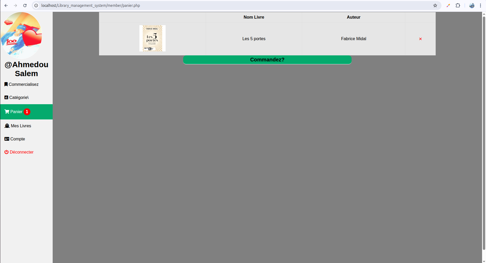

### Ordered books
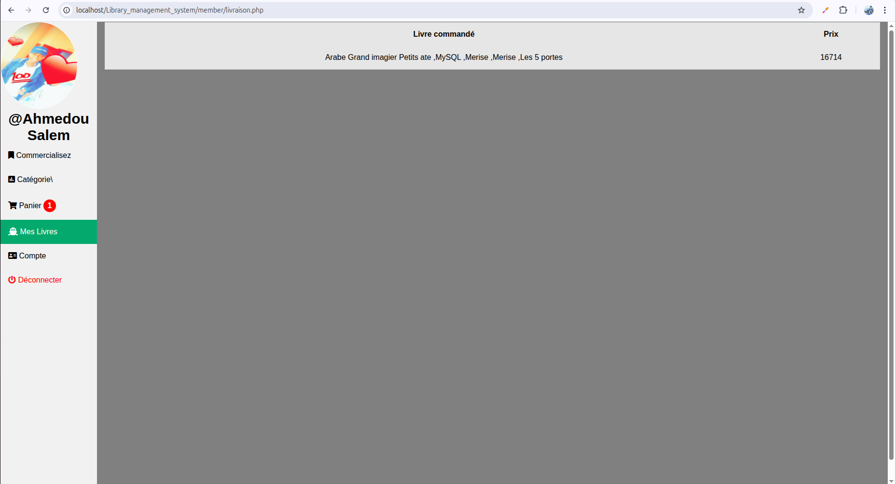

### Account page
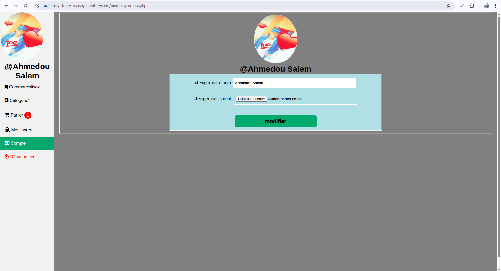

### Librarian login
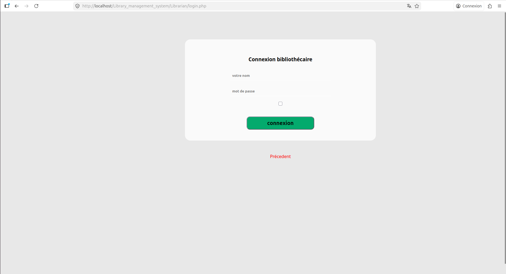

### Librarian dashboard
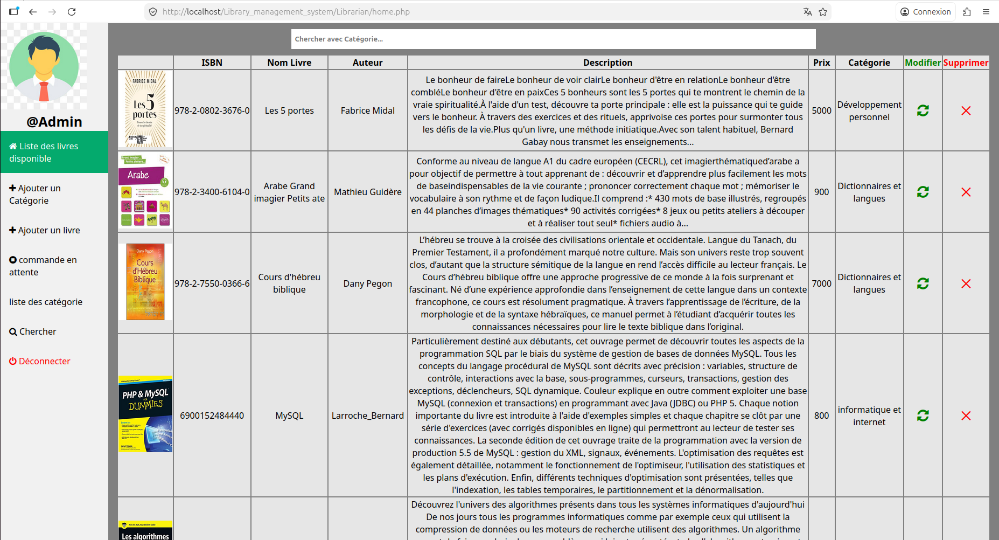

### Add category
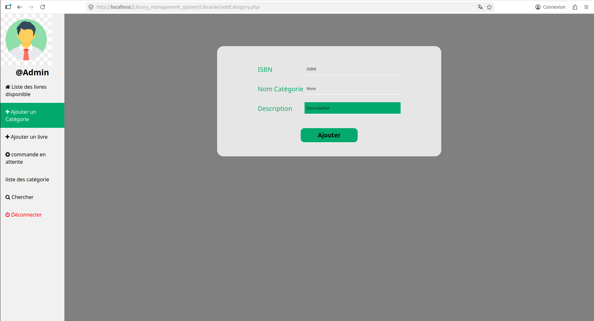

### Add book
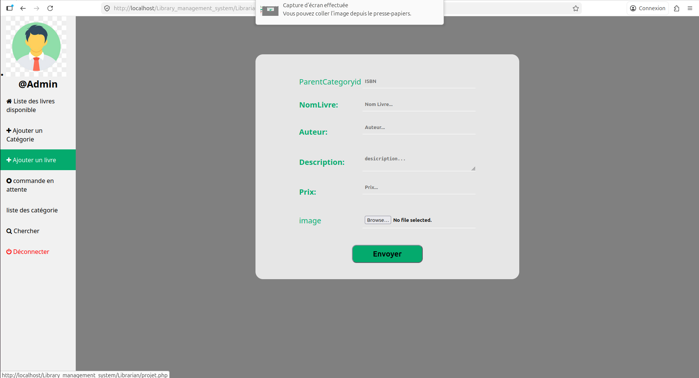

### Category list
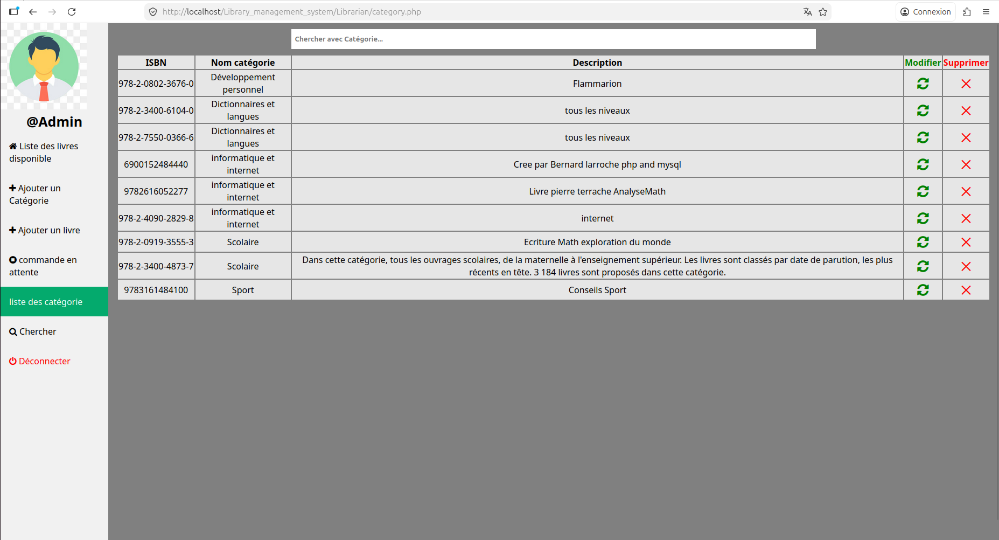

### Search panel
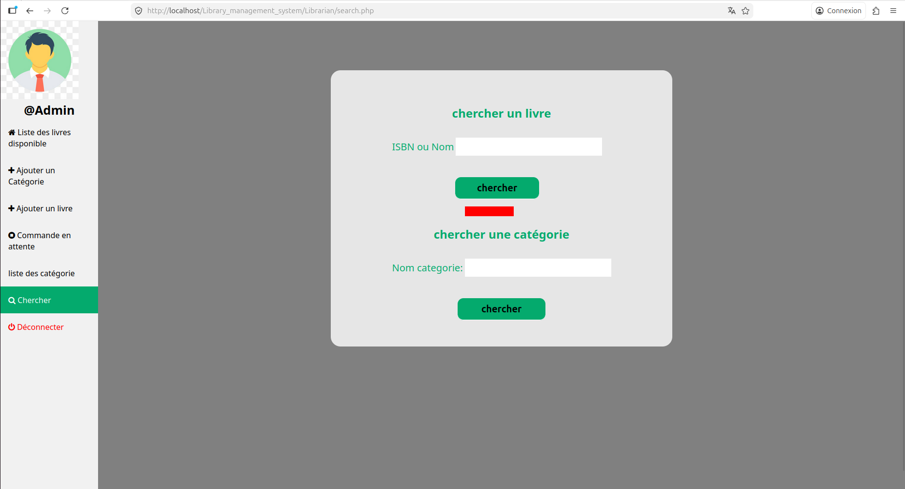

### Edit book
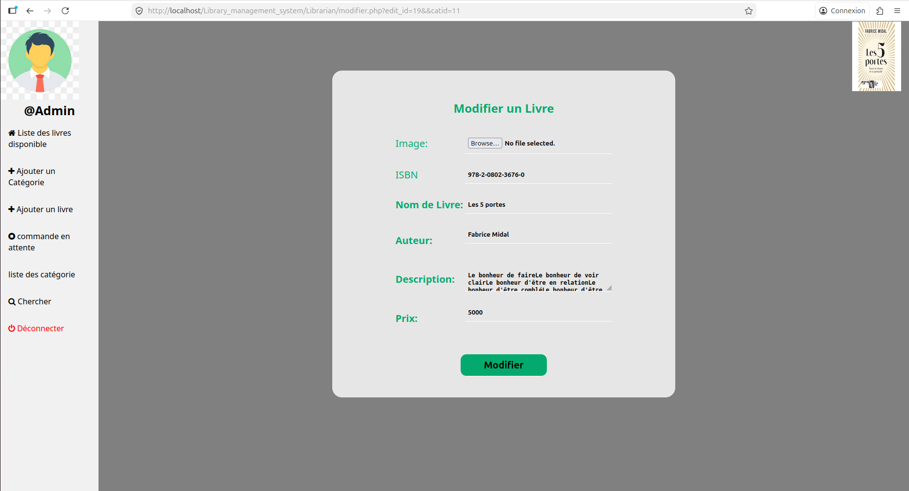

### Edit category
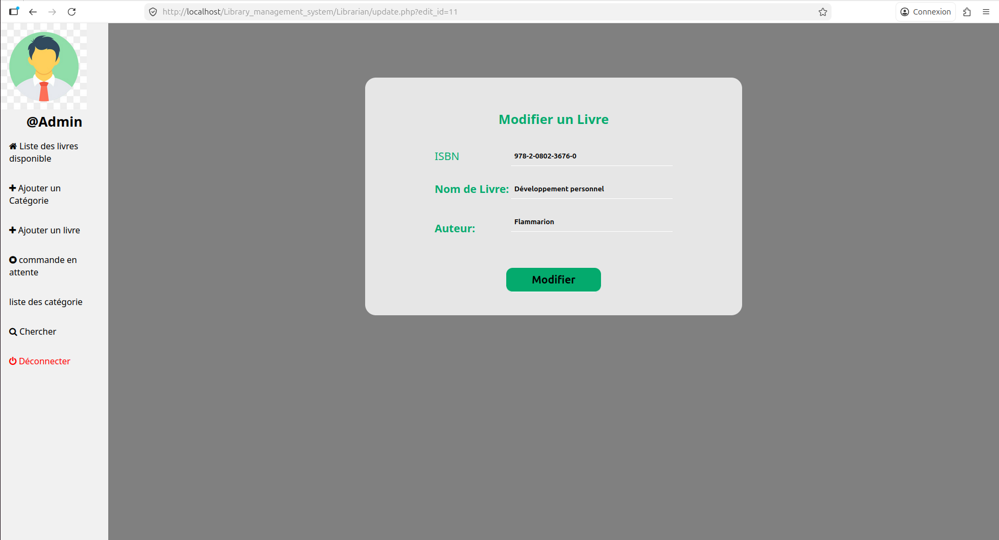

### Pending orders
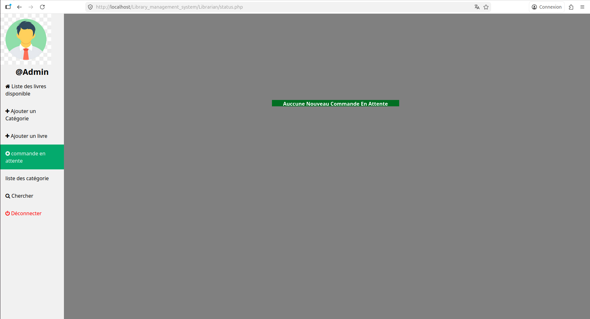

### Delete confirmation
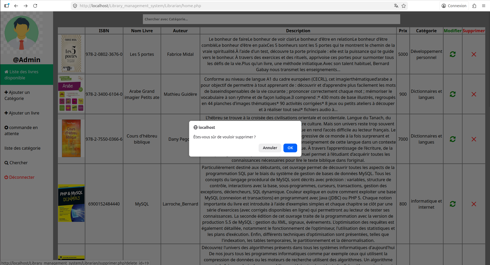

## What I Practiced

- Building a complete PHP web application without a framework
- Handling authentication flows for two user roles
- Implementing CRUD operations with MySQL
- Creating search and filter features
- Managing image upload and display
- Designing a relational database for catalog, cart, and order logic
- Organizing a multi-page application with client and librarian spaces

## Limitations

This project was developed as a learning project, so several improvements are possible:

- stronger password security and hashing strategy
- prepared statements to improve SQL safety
- cleaner architecture and refactoring
- better responsive design
- improved validation and error handling
- more advanced order management workflow

## Possible Improvements

- migrate to **Laravel** or **Symfony**
- replace raw SQL usage with **PDO / prepared statements**
- introduce a cleaner MVC structure
- add pagination and better filtering
- improve UI consistency and responsiveness
- add automated tests
- add role-based authorization checks

## Author

**Ahmedou Salem**

GitHub: [AhmedouSalem](https://github.com/AhmedouSalem)

## Repository

[Library_management_system](https://github.com/AhmedouSalem/Library_management_system)
